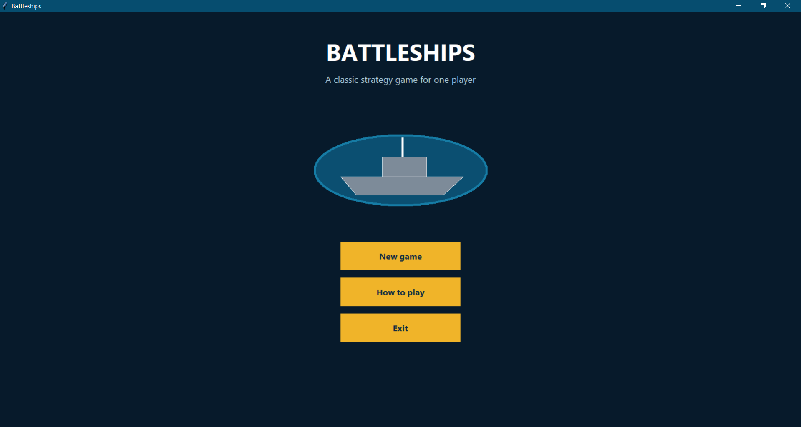
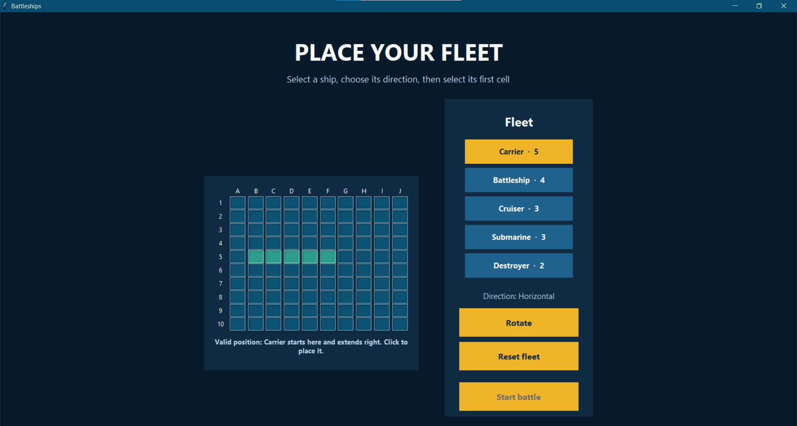
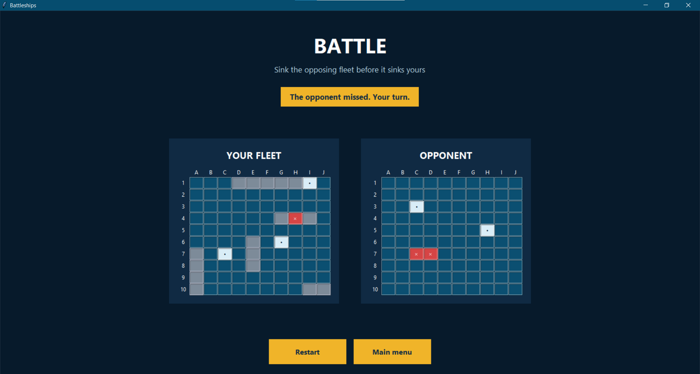

# Battleships — Python Desktop Game

A single-player implementation of the classic Battleships strategy game, developed in Python with a graphical interface built using Tkinter.

The player places a fleet on a 10 × 10 board and takes turns firing at a computer-controlled opponent. The first side to sink the entire opposing fleet wins.

<p align="center">
  
</p>

## Features

- Graphical desktop interface built with Tkinter
- Start menu and in-game instructions
- Interactive placement of five different ships
- Horizontal and vertical ship orientation
- Live placement preview before confirming a position
- Validation for overlaps and positions outside the board
- Turn-based combat against a computer opponent
- Visual feedback for hits, misses, and sunk ships
- Prevention of repeated attacks on the same cell
- Victory and defeat detection
- Fleet reset, game restart, and return-to-menu controls
- Maximized window on startup

## Fleet

| Ship | Size |
| --- | ---: |
| Carrier | 5 cells |
| Battleship | 4 cells |
| Cruiser | 3 cells |
| Submarine | 3 cells |
| Destroyer | 2 cells |

## Gameplay

### 1. Place the fleet

Select a ship and move the pointer over the board to preview its position.

- A green preview indicates a valid position.
- A red preview indicates an overlap or a position outside the board.
- Horizontal ships extend to the right from the selected cell.
- Vertical ships extend downward from the selected cell.

Use **Rotate** to change orientation and **Reset fleet** to clear all placements. The battle can begin only after all five ships have been placed.

### 2. Attack the opponent

Select a cell on the opponent's board to fire. The computer then performs its own attack after a short delay.

- Red `×` — hit
- Light `•` — miss
- Dark red cells — sunk ship

### 3. Win the game

The game ends when either the player or the computer sinks all five opposing ships.

## Technology

- Python 3.10+
- Tkinter
- Python standard-library modules: `random` and `dataclasses`

The current version has no third-party package dependencies.

## Installation and Running

### Windows

1. Install Python 3 from [python.org](https://www.python.org/downloads/).
2. Download or clone this repository.
3. Open a terminal in the project directory.
4. Run:

```powershell
python .\src\battleships.py
```

Tkinter is normally included with the standard Windows Python installation.

### PyCharm

1. Open the project directory in PyCharm.
2. Select a Python 3.10 or newer interpreter.
3. Open `src/battleships.py`.
4. Select **Run 'battleships'**.

## Project Structure

```text
battleships-python/
|-- docs/
|   +-- images/          # README screenshots
|-- src/
|   +-- battleships.py   # Complete game implementation
|-- .gitignore
|-- LICENSE
\-- README.md
```

## Implementation Notes

Each ship is represented by a name and a set of board coordinates. Placement is accepted only if every coordinate is inside the grid and none is already occupied.

The computer fleet is generated randomly with the same placement constraints. During combat, the computer randomly selects from cells it has not attacked previously. A ship is considered sunk when every one of its coordinates is present in the opposing side's set of successful shots.

## Screenshots

### Fleet placement

The placement screen provides a live color-coded preview before a ship is added to the board.



### Battle gameplay

The battle screen displays the player's fleet, the hidden opponent board, previous hits and misses, and the current turn status.



## Limitations

- The game currently supports one player against a local computer opponent.
- The opponent selects valid, previously unused cells randomly and does not use an advanced targeting strategy.
- Game progress is not saved between sessions.

## Author

**Daria-Ioana Szabo**

## License

This project is available under the MIT License. See [LICENSE](LICENSE) for details.
